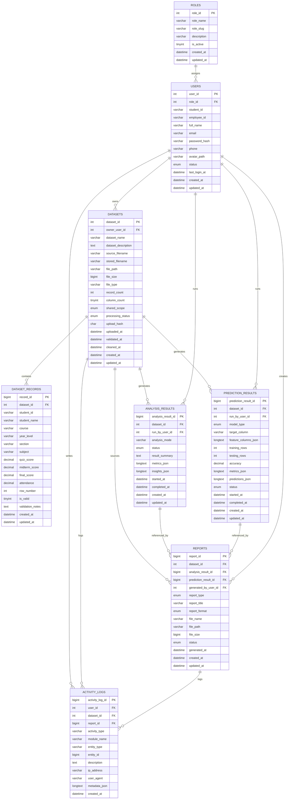

# Phase 2 ERD

```mermaid
erDiagram
    ROLES ||--o{ USERS : assigns
    USERS ||--o{ DATASETS : owns
    DATASETS ||--o{ DATASET_RECORDS : contains
    DATASETS ||--o{ ANALYSIS_RESULTS : generates
    DATASETS ||--o{ PREDICTION_RESULTS : generates
    DATASETS ||--o{ REPORTS : sources
    ANALYSIS_RESULTS ||--o{ REPORTS : referenced_by
    PREDICTION_RESULTS ||--o{ REPORTS : referenced_by
    USERS ||--o{ ANALYSIS_RESULTS : runs
    USERS ||--o{ PREDICTION_RESULTS : runs
    USERS ||--o{ REPORTS : creates
    USERS ||--o{ ACTIVITY_LOGS : writes
    DATASETS ||--o{ ACTIVITY_LOGS : logs
    REPORTS ||--o{ ACTIVITY_LOGS : logs

    ROLES {
        int role_id PK
        varchar role_name
        varchar role_slug
        varchar description
        tinyint is_active
        datetime created_at
        datetime updated_at
    }

    USERS {
        int user_id PK
        int role_id FK
        varchar student_id
        varchar employee_id
        varchar full_name
        varchar email
        varchar password_hash
        varchar phone
        varchar avatar_path
        enum status
        datetime last_login_at
        datetime created_at
        datetime updated_at
    }

    DATASETS {
        int dataset_id PK
        int owner_user_id FK
        varchar dataset_name
        text dataset_description
        varchar source_filename
        varchar stored_filename
        varchar file_path
        bigint file_size
        varchar file_type
        int record_count
        tinyint column_count
        enum shared_scope
        enum processing_status
        char upload_hash
        datetime uploaded_at
        datetime validated_at
        datetime cleaned_at
        datetime created_at
        datetime updated_at
    }

    DATASET_RECORDS {
        bigint record_id PK
        int dataset_id FK
        varchar student_id
        varchar student_name
        varchar course
        varchar year_level
        varchar section
        varchar subject
        decimal quiz_score
        decimal midterm_score
        decimal final_score
        decimal attendance
        int row_number
        tinyint is_valid
        text validation_notes
        datetime created_at
        datetime updated_at
    }

    ANALYSIS_RESULTS {
        bigint analysis_result_id PK
        int dataset_id FK
        int run_by_user_id FK
        varchar analysis_mode
        enum status
        text result_summary
        longtext metrics_json
        longtext insights_json
        datetime started_at
        datetime completed_at
        datetime created_at
        datetime updated_at
    }

    PREDICTION_RESULTS {
        bigint prediction_result_id PK
        int dataset_id FK
        int run_by_user_id FK
        enum model_type
        varchar target_column
        longtext feature_columns_json
        int training_rows
        int testing_rows
        decimal accuracy
        longtext metrics_json
        longtext predictions_json
        enum status
        datetime started_at
        datetime completed_at
        datetime created_at
        datetime updated_at
    }

    REPORTS {
        bigint report_id PK
        int dataset_id FK
        bigint analysis_result_id FK
        bigint prediction_result_id FK
        int generated_by_user_id FK
        enum report_type
        varchar report_title
        enum report_format
        varchar file_name
        varchar file_path
        bigint file_size
        enum status
        datetime generated_at
        datetime created_at
        datetime updated_at
    }

    ACTIVITY_LOGS {
        bigint activity_log_id PK
        int user_id FK
        int dataset_id FK
        bigint report_id FK
        varchar activity_type
        varchar module_name
        varchar entity_type
        bigint entity_id
        text description
        varchar ip_address
        varchar user_agent
        longtext metadata_json
        datetime created_at
    }
```
